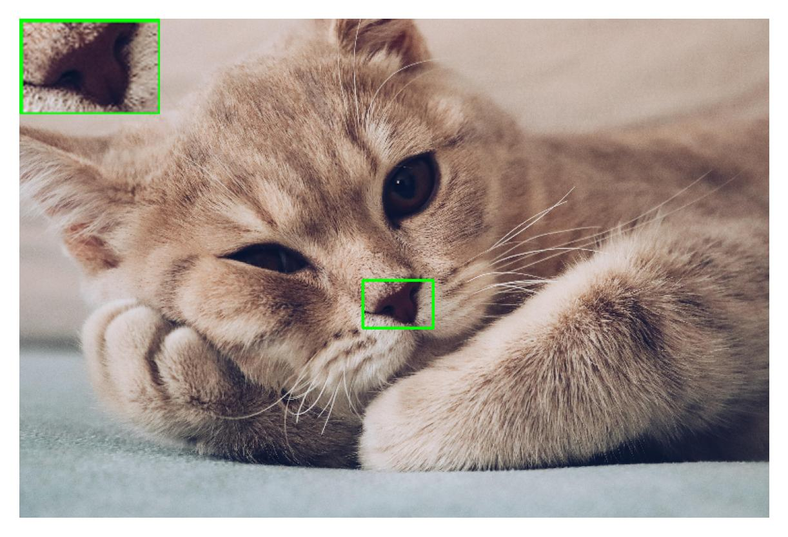

# 局部放大小工具

## 使用步骤
- 将图片放在`picss`文件夹中
- 默认保存在`bpart`文件夹中

## 功能说明
- `长按左键，移动鼠标`：实时显示框选的框，可多选
- `右键点击`：回退，消除上一个框
- `中间滚动`:实时显示放大区域
- `中键点击`:保存两倍放大框选区域，并保存在bpart文件夹下，无框选则进去下一张
- `叉掉展示框`：进入下一张  

## 使用注意
- `从左往右，从上往下框选区域`
- `放大的部分，默认瞬时针的放在图片四个角以及图片中间`
- `建议按顺时针框区，且不宜过大`

## 效果示例

